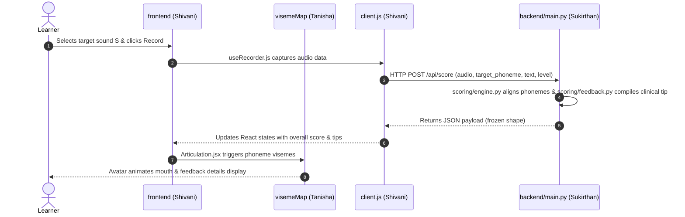

# Build Log — Suchit (Lead)
_Generated by Antigravity on 2026-07-29_

## 1. What I built
I built the setup, scaffolding, and configuration foundation for the Smart Articulation System. This includes setting up the API contracts for scoring and phonetic mappings, configuring the build server and folder paths for the React client, loading the Tailwind CSS design system with custom warm theme variables, and compiling initial documentation to guide the 3D animation, frontend design, and AI scoring teams.

## 2. Files created
| Path | Purpose | Why it lives here |
|---|---|---|
| `README.md` | General team instructions, layout architecture, and local environment execution guidelines. | Root of project for primary developer visibility. |
| `.gitignore` | Prevents local runtime assets, vendor dependencies, virtual environments, and compiler logs from polluting git commits. | Root of project to define project-wide tracking exclusions. |
| `frontend/vite.config.js` | Configures the Vite dev-server plugins and allows safe filesystem traversal to the parent directory. | Frontend root; required for the client to directly import contract JSON files. |
| `frontend/tailwind.config.js` | Custom color themes (`paper`, `ink`, `wrong`, etc.) and typography styles mapped from CSS custom properties. | Frontend root; tells Tailwind where to find markup and how to resolve classes. |
| `frontend/src/index.css` | Defines audiology-style design tokens, typeface URLs, layout guidelines, and clinical status classes. | Frontend style root; injected globally. |
| `frontend/src/main.jsx` | Client entry-point initializing the React React DOM root and wrapping the application tree in `BrowserRouter`. | Frontend execution root. |
| `docs/demo-script.md` | Minute-by-minute timeline script for the final hackathon showcase pitch and sample clinical feedback responses. | Documentation root; establishes feature scope early. |
| `docs/pitch-outline.md` | Derived slide deck structure corresponding to the demo script sections and judge Q&A prep sheets. | Documentation root. |
| `docs/build-log-suchit.md` | This handover document. | Documentation root. |

## 3. Decisions I made
* **Vite Filesystem Allowance**: I added `server.fs.allow = ['..']` in `vite.config.js` to enable importing files directly from the parent `contracts/` directory. The alternative was replicating JSON files in the frontend public directory, which risks contract drift if changes occur.
* **Tailwind v4 Setup Integration**: Mapped tailwind utility boundaries in `tailwind.config.js` to use CSS custom properties defined in `index.css`. This ensures that all components use pre-defined theme variables rather than raw, ad-hoc hex values.
* **Routing at Root**: Wrapped the application in `<BrowserRouter>` inside `main.jsx` at Day 1 so the team can build client routes (`Home`, `Practice`, `Progress`) from the start without setup restructuring later.

## 4. The contract, explained
* **`POST /api/score`**:
  * **Sends**: Form-data containing the recorded `audio` file, target phoneme `target_phoneme` (e.g. `"S"`), the text they read `target_text`, and the clinical hierarchy level `level` (`sound`/`word`/`sentence`).
  * **Receives**: A frozen JSON payload returning the `overall_score`, a status `verdict`, list of `expected` phonemes vs `heard` phonemes, per-phoneme timing intervals, and a targeted clinical improvement `tip`.
* **Phoneme representation**: Locked to uppercase ARPAbet naming conventions (e.g. `SH`, `TH`, `AH`). This prevents character matching failures in backend engines and frontend viseme maps. No lowercase phonetic strings or IPA representations are ever passed in API payloads.
* **Frozen response shape**: Protects the frontend and animation layers from breaking changes by guaranteeing a consistent payload format. Shivani and Tanisha can write strict parser code confidently knowing the JSON structure will never change.

## 5. How the pieces connect


## 6. Verification I ran
* **JSON Validation**: Verified JSON syntax using:
  ```powershell
  python -c "import json;[json.load(open(f)) for f in ['contracts/phonemes.json','contracts/content.json']];print('json ok')"
  # Output: json ok
  ```
* **Contract Integrity**: Wrote and executed a throwaway script verifying that:
  1. All target phonemes exist inside `phonemes.json`.
  2. Every phonetic expectation matches valid ARPAbet symbols listed in `CONTRACT.md`.
  3. Every sound-level expectation array contains exactly one element.
  4. Targets successfully feature `sound`, `word`, and `sentence` levels.
  * *Result*: Script reported `All contracts assertions passed successfully!` with no errors.
* **Frontend Compilation Check**: Ran `npm run build` using the Windows CMD boundary:
  ```cmd
  vite v8.1.5 building client environment for production...
  transforming...✓ 20 modules transformed.
  rendering chunks...
  dist/assets/index-DykytF2W.css    4.10 kB
  dist/assets/index-m4QzboyB.js   193.35 kB
  ✓ built in 515ms
  ```

## 7. What I deliberately did NOT do
* **Did not create components or page views**: I did not construct files inside `frontend/src/pages/` or `frontend/src/components/` (except the config entrypoints) to avoid merging conflicts on Shivani's frontend work.
* **Did not touch animation algorithms or avatar rigs**: Avoided creating `Avatar.jsx` or viseme lists. Tanisha owns `frontend/src/animation/` completely.
* **Did not touch backend routing logic**: The `backend/main.py` is initialized but untouched. Sukirthan owns backend scoring algorithms.

## 8. Known gaps and risks
* **Audio Mime-Type Differences**: The frontend recording hook must account for browser difference outputs (Chrome records as `audio/webm;codecs=opus`, while Safari on iOS produces `audio/mp4` or WAV).
* **Venue Network Dependencies**: If the real backend engine becomes slow or times out (> 4 seconds), the client must fail gracefully and show a warning without crashing.

## 9. Handover notes
* **For Shivani**:
  * Design system styles and custom color classes (e.g. `bg-paper`, `text-signal`) are fully configured in `index.css`.
  * The React root is wrapped in `<BrowserRouter>` inside `main.jsx`. You can start building client routing maps.
* **For Tanisha**:
  * Viseme configurations and visual look-alike group notes are defined inside `contracts/phonemes.json`.
* **For Sukirthan**:
  * The API contracts and expected responses are defined in `contracts/CONTRACT.md`. Ensure FastAPI routes match this model exactly.

## 10. Exact commands to run this
### Initial Setup
```bash
git clone <repo-url>
cd smart-articulation
```
### Running Frontend
```bash
cd frontend
npm install
npm run dev
```
### Running Backend
```bash
cd backend
python -m venv .venv
# On Windows:
.venv\Scripts\activate
# On Unix:
source .venv/bin/activate
pip install -r requirements.txt
uvicorn main:app --reload
```
